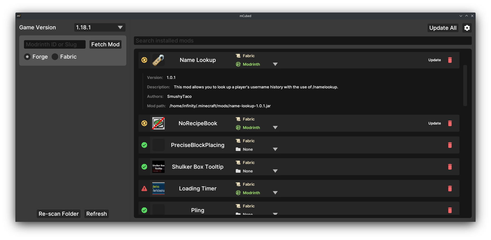

`mCubed` (short for **M**inecraft **M**od **M**anager) is an experimental mod manager early into development, so expect bugs when testing. Feedback on the project is greatly appreciated.

---

# Download

Prebuilt binaries can be found on the [releases page](https://github.com/4JX/mCubed/releases). You can also use the builds uploaded via [github actions](https://github.com/4JX/mCubed/actions).

# Preview

